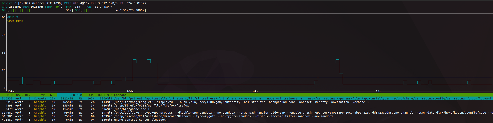

# Local Installation:

```bash
sudo apt update && sudo apt install -y \
    python3-pip ffmpeg xvfb \
    swig build-essential python3-dev

pip install --no-cache-dir --index-url https://download.pytorch.org/whl/cu128 \
    torch==2.7.1 torchvision==0.22.1 torchaudio==2.7.1


cd path/to/ros2_ws

pip install --no-cache-dir -r .devcontainer/requirements.txt

rosdep update && rosdep install --rosdistro humble --from-paths src --ignore-src -r -y
```

# All-in-One Installation with Docker (Recommended):

**Requirements:**
- Docker
- Nvidia Container Toolkit

If Docker is not installed, follow:  
[Install Docker](docker_install.md)

If Nvidia Container Toolkit is not installed, follow:  
[Install Nvidia Container Toolkit](nvidia_container_toolkit_install.md)


**Start the development container:**
```sh
cd ~ros2_ws/.devcontainer
docker compose up ros2_end_to_end_learning_container
```

**VS Code Integration:**
1. Open Visual Studio Code.
2. Go to the **Docker** tab (install the Docker extension if needed).
3. Locate the container (e.g., `ros2/optimization`).
4. Right-click and select **Attach to Container**.
5. A new VS Code window will open inside the container.
6. Open the terminal within the container.
7. Navigate to the `/app` folder and open it in VS Code.

**Tip:**  
Use ROS 2 aliases for common tasks (e.g., building, sourcing, ...).
```sh
cd ~ros2_ws
source .bash_aliases
```

# Hardware Requirements



Typical VRAM usage for the provided RL examples is approximately 2.3 GB (tested on an RTX 4090). Actual consumption varies with network size, batch size, number of parallel environments, and rendering.