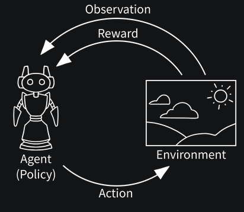
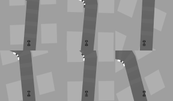
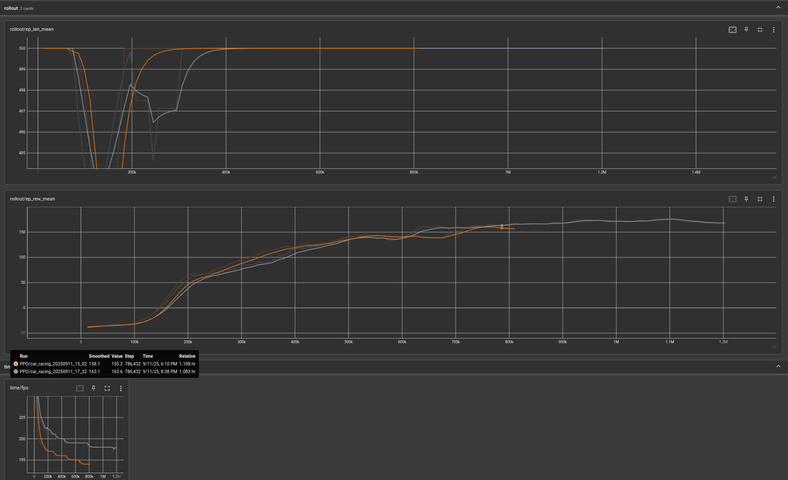

# End-to-End Learning:
In the End-to-End Learning Lab, you will learn the practical implementation of Deep Reinforcement Learning (DRL) algorithms in a robotics context. The provided ROS 2 examples illustrate key DRL algorithms, the standard training and evaluation pipeline, and how to design and adapt environments for DRL.

## 1 Conceptual Background:
Designing control systems for robots is challenging—especially for systems with high degrees of freedom, nonlinear effects (e.g., friction), or environments that are difficult to model. Traditionally, engineers elicit requirements, derive mathematical models of the robot and its environment, and tune classical controllers such as PID, LQR, or MPC to meet performance targets.

Deep Reinforcement Learning (DRL) offers an alternative: given the observation space, action space, and an environment, an agent can learn control policies through trial and error. Training purely on real hardware is usually impractical due to data demands, safety risks, and time constraints. Simulation addresses these issues by enabling fast, scalable, and safe data collection—often via many parallel environments on GPUs. Policies trained in simulation can then be deployed to real robots and, if necessary, fine‑tuned on hardware (e.g., with domain randomization and sim‑to‑real techniques).

### 1.1 Overview:



*Fig. 1: [Reinforcement Learning Training Cycle](https://gymnasium.farama.org/introduction/basic_usage/)*

In RL, an agent uses a policy (also known as Agent) to interact with an environment. At each time step, the agent receives an observation, selects an action, and the environment returns the next observation, a scalar reward, and termination/truncation signals. Training proceeds over many episodes or steps according to a chosen budget (e.g., total_timesteps). Trained models can be saved and reloaded for evaluation and deployment.

### 1.2 Environment:
In Deep RL, the environment defines four things: Observation Space, Action Space, reward, and episode boundaries. It exposes:
- reset() -> (observation, info)
- step(action) -> (observation, reward, terminated, truncated, info)

**Signals:**
- terminated: task finished or failed
- truncated: episode cut short (e.g., time limit)

**Mental model:**
- Observation Space = what the agent can sense
- Action Space = what the agent is allowed to do

Docs: https://gymnasium.farama.org/api/env/

#### 1.2.1 Observation Space:
Describes the shape, range, and dtype of observations the environment returns.

- **Types:**

    | Type        | Description                                                      |
    |-------------|------------------------------------------------------------------|
    | Box         | Real-valued vectors or images with explicit lower/upper bounds.  |
    | Discrete    | One integer in [0, n-1].                                         |
    | MultiDiscrete | Multiple discrete integers, each with its own range.          |
    | MultiBinary | Binary vector of length n (0/1).                                 |
    | Tuple       | Ordered collection of sub-spaces.                                |
    | Dict        | Named collection of sub-spaces.                                  |

- **Examples:**

    | Case                         | Spec                                                          | Meaning                                 |
    |-----------------------------|---------------------------------------------------------------|-----------------------------------------|
    | Box (vector)                | `Box(shape=(4,), dtype=float32)`                              | CartPole state                          |
    | Box (image)                 | `Box(low=0, high=255, shape=(84,84,3), dtype=uint8)`          | RGB frame                               |
    | Discrete                    | `Discrete(3)`                                                 | Traffic light {red, yellow, green}      |
    | MultiDiscrete               | `MultiDiscrete([6, 3])`                                       | Gear 0..5, turn signal 0..2             |
    | MultiBinary                 | `MultiBinary(10)`                                             | 10 contact sensors                      |
    | Tuple                       | `Tuple((Discrete(3), Box(low=-1, high=1, shape=(2,), dtype=float32)))` | Mode + 2D reading               |
    | Dict                        | `{imu: Box(...), camera: Box(...), contact: MultiBinary(4)}`  | Heterogeneous sensors                   |

#### 1.2.2 Action Space:
Describes the shape, range, and dtype of actions the agent can take.

- **Types:**
    | Type          | Description                                 |
    |---------------|---------------------------------------------|
    | Discrete      | Finite set of actions.                      |
    | Box (continuous) | Real-valued vectors with bounds and dtype. |
    | MultiDiscrete | Several independent discrete components.    |
    | MultiBinary   | Multiple on/off toggles.                    |
    | Tuple         | Ordered sub-actions.                        |
    | Dict          | Named sub-actions.      

- **Examples:**
    | Case                       | Spec                                                          | Meaning                               |
    |---------------------------|---------------------------------------------------------------|---------------------------------------|
    | Discrete (CartPole)       | `Discrete(2)`                                                 | Actions: {left, right}                |
    | Discrete (LunarLander)    | `Discrete(4)`                                                 | Thrusters: {noop, left, main, right}  |
    | Box (steer, throttle)     | `Box(low=-1.0, high=1.0, shape=(2,), dtype=float32)`          | Continuous steering and throttle      |
    | Box (4 joint torques)     | `Box(low=-2.0, high=2.0, shape=(4,), dtype=float32)`          | Torque per joint                      |
    | MultiDiscrete              | `MultiDiscrete([6, 3])`                                       | Gear, indicator                       |
    | MultiBinary                | `MultiBinary(6)`                                              | Thrusters on/off                      |
    | Tuple (mode + params)     | `Tuple((Discrete(3), Box(low=-1, high=1, shape=(2,), dtype=float32)))` | Hybrid: mode + params        |
    | Dict (hybrid)             | `{mode: Discrete(3), velocity: Box(...), gripper: MultiBinary(1)}` | Mixed action schema             |


#### 1.2.3 Reward:
- A scalar feedback per step that tells the agent how good its last transition was.
- The learning objective is to maximize the expected [discounted return](https://deepanshut041.github.io/Reinforcement-Learning/notes/00_Introduction_to_rl/):
  $$G_t = \sum_{k=0}^{\infty} \gamma^{k}\, r_{t+k+1}, \quad \gamma \in [0,1].$$

**Why it is needed?**
- **Guides behavior:** without reward there is no preference between actions.
- **Shapes credit assignment:** frequent, well-scaled rewards stabilize training.

**Common reward styles:**
- **Sparse:** only given at success/failure (e.g., +1 on goal, 0 otherwise). Simple but hard to discover.
- **Dense (shaped):** informative every step (e.g., velocity toward goal, distance penalty). Easier to learn but can bias behavior.
- **Mixed:** sparse terminal bonuses plus small shaping terms.
- **Penalties:** time, energy, collisions, going off-track.

**Design tips:**
- **Scale:** keep magnitudes roughly within [-1, 1] or normalize (VecNormalize for rewards).
- **Consistency:** same units across episodes; avoid changing scales mid-training.
- **Terminal bonuses/penalties:** add clear signals at success (+R) or failure (-R).
- **Shaping without changing the optimal policy:** potential-based shaping
  r’(s,a,s’) = r(s,a,s’) + gamma * Phi(s’) - Phi(s)
- **Avoid reward hacking:** audit that maximizing reward equals desired behavior.

**Notes:**
- Algorithms are sensitive to reward scale. If learning is unstable, normalize rewards and keep observation dtypes sane (pixels as uint8, vectors as float32).
- Do not change Observation/Action spaces during training; wrappers that change shape must do so consistently (e.g., GrayScale, Resize, FrameStack).


### 1.3 Agent & Policy

An agent interacts with the environment using a policy (the mapping from observations to actions). You typically:
1. Start with a well-known benchmark environment (e.g., CartPole, LunarLander).
2. Validate the training loop (learning curves, logging).
3. Incrementally adjust observation/action spaces or reward shaping.
4. Only then move to the robotics/simulation task.

Key relatively robust (lower hyperparameter sensitivity) algorithms:
- PPO (general baseline, discrete + continuous)
- SAC (continuous, good sample efficiency, entropy-regularized)
- TD3 (continuous, deterministic policy, needs proper exploration)
- (Optional) TQC / RecurrentPPO / MaskablePPO for specific needs

Reference tips: https://stable-baselines3.readthedocs.io/en/master/guide/rl_tips.html#tl-dr

#### 1.3.1 [Limitations:](https://stable-baselines3.readthedocs.io/en/master/guide/rl_tips.html#current-limitations-of-rl)
| Area                | Typical Limitation / Risk                                    |
|---------------------|---------------------------------------------------------------|
| Sparse rewards      | Extremely slow exploration without curriculum or shaping.     |
| High-dimensional obs| Sample inefficiency; need CNNs + normalization.               |
| Sim2Real gap        | Dynamics mismatch → need domain randomization.                |
| Non-stationarity    | Changing env specs mid-run destabilizes replay/value targets. |
| Reproducibility     | GPU nondeterminism & asynchronous sampling add variability.   |

#### 1.3.2 [Which algorithm should I use?](https://stable-baselines3.readthedocs.io/en/master/guide/rl_tips.html#which-algorithm-should-i-use)
(No single best algorithm; depends on action space, stationarity, compute budget.)

| Scenario                               | Recommended Starting Points                       | Notes |
|----------------------------------------|---------------------------------------------------|-------|
| Discrete, simple (≤ few dozen actions) | DQN (baseline), PPO, A2C                          | DQN needs tuning (lr, eps schedule). |
| Discrete, larger / masked actions      | PPO / MaskablePPO                                 | MaskablePPO if invalid actions occur. |
| Continuous (low–mid dim)               | SAC, PPO, TD3                                     | SAC often most stable; TD3 deterministic. |
| Continuous (high variance rewards)     | SAC (entropy helps)                               | Tune learning rate & replay size. |
| Recurrent / partial observability      | RecurrentPPO                                      | Needs proper sequence length. |
| Goal-conditioned tasks                 | HER + (SAC or DDPG or TD3)                        | Reward must expose achieved/desired goals. |
| Fast prototyping with many CPUs        | PPO (vectorized), A2C                             | On‑policy scales well with many envs. |
| Action masking needed (discrete)       | MaskablePPO                                       | Provide valid action mask each step. |

#### 1.3.3 [Tips and Tricks when creating a custom environment:](https://stable-baselines3.readthedocs.io/en/master/guide/rl_tips.html#tips-and-tricks-when-creating-a-custom-environment)
| Aspect                  | Guidance |
|-------------------------|----------|
| Observation scaling     | Normalize (mean/std) or use wrappers. |
| Action space            | Prefer symmetric range (e.g., [-1,1]) for continuous. |
| Reward shaping          | Use potential-based shaping to preserve optimality. |
| Logging                 | Track episode reward, length, value loss, entropy. |
| Curriculum              | Gradually increase difficulty if sparse reward. |

#### 1.3.4 Normalizing the Action Space:
Some policy gradient methods model actions as Gaussian distributions. Unscaled or asymmetric bounds can:
- Skew gradient magnitudes
- Harm exploration
Remedy: map internal tanh output to [-1,1] then scale to real actuator limits.

#### 1.3.5 [RL Algorithms](https://stable-baselines3.readthedocs.io/en/master/guide/algos.html#rl-algorithms):

| Name           | Box | Discrete | MultiDiscrete | MultiBinary | Multi Processing |
|----------------|:---:|:--------:|:-------------:|:-----------:|:----------------:|
| ARS            | ✓   | ✓        | ✗             | ✗           | ✓                |
| A2C            | ✓   | ✓        | ✓             | ✓           | ✓                |
| CrossQ         | ✗   | ✓        | ✗             | ✗           | ✗                |
| DDPG           | ✓   | ✗        | ✗             | ✗           | ✗                |
| DQN            | ✗   | ✓        | ✗             | ✗           | ✗                |
| HER            | ✓   | ✓        | ✗             | ✗           | ✓                |
| PPO            | ✓   | ✓        | ✓             | ✓           | ✓                |
| QR-DQN         | ✗   | ✓        | ✗             | ✗           | ✗                |
| RecurrentPPO   | ✓   | ✓        | ✓             | ✓           | ✓                |
| SAC            | ✓   | ✗        | ✗             | ✗           | ✗                |
| TD3            | ✓   | ✗        | ✗             | ✗           | ✗                |
| TQC            | ✓   | ✗        | ✗             | ✗           | ✗                |
| TRPO           | ✓   | ✗        | ✗             | ✗           | ✓                |
| Maskable PPO   | ✗   | ✓        | ✓             | ✓           | ✓                |

#### 1.3.6 [Reproducibility](https://stable-baselines3.readthedocs.io/en/master/guide/algos.html#reproducibility):
| Element                     | How to Seed |
|----------------------------|-------------|
| Python / random            | random.seed(n) |
| NumPy                      | np.random.seed(n) |
| PyTorch (CPU/GPU)          | torch.manual_seed(n), torch.cuda.manual_seed_all(n) |
| Env dynamics/reset         | env.reset(seed=n) |
| Action sampling            | env.action_space.seed(n) |
| Vectorized envs            | make_vec_env(..., seed=n) |

Even with all seeds set, CUDA kernels, thread scheduling, and physics engines can introduce small divergences.

#### 1.3.7 Minimal Seeding Example
```python
import random, numpy as np, torch, gymnasium as gym
seed = 42
random.seed(seed)
np.random.seed(seed)
torch.manual_seed(seed)
env = gym.make("CartPole-v1")
env.reset(seed=seed)
env.action_space.seed(seed)
```

#### 1.3.8 [Training exceeds `total_timesteps`](https://stable-baselines3.readthedocs.io/en/master/guide/algos.html#training-exceeds-total-timesteps):
  - Why: SB3 stops after completing a full rollout/training chunk, not mid-collection.
  - On-policy (PPO/A2C/TRPO): overshoot ≤ n_envs × n_steps. Pick total_timesteps = k × (n_envs × n_steps) to avoid overshoot.
  - Off-policy (SAC/TD3/DQN): overshoot ≤ n_envs × train_freq (step-based). Use multiples of that chunk size.
  - With VecEnv, the timestep counter increases by n_envs per env.step (counts transitions across all envs).

### 1.4 Episodes:
An episode is the sequence from env.reset() to an end signal. It has a length (number of steps) and a return (sum of rewards).

- Termination vs truncation:
  - terminated = task ended naturally (success or failure defined by the MDP).
  - truncated = episode was cut short (e.g., time limit, safety cutoff, external stop).
  - In code: done = terminated or truncated. After either, that env must be reset before stepping again.

- Vectorized environments (VecEnv):
  - n_envs run in parallel; each sub‑env has its own episode.
  - If one sub‑env i ends (terminated[i] or truncated[i] is True), only that sub‑env is reset; others continue running.
  - SB3 VecEnvs auto‑reset ended sub‑envs and expose final_observation/final_info in infos[i] for logging.
  - The global timestep counter advances by n_envs per vec step (one transition per sub‑env).

- Episode vs. Rollout:
  - Episode: a complete trajectory in a single environment from reset() to terminated/truncated.
  - Rollout (on‑policy, e.g., PPO/A2C in SB3): a fixed batch of transitions collected for one update, of size n_envs × n_steps. It may start/end in the middle of episodes and thus contains fragments from multiple episodes across parallel envs.
  - Rollout (off‑policy, e.g., SAC/TD3/DQN): the number of env steps gathered between gradient updates; samples are pushed to a replay buffer and updates are decoupled from episode boundaries.

## 2 Gymnasium Examples:
These minimal examples were created for this lab. They show how to:
- Train PPO on classic control tasks (single environment).
- Evaluate a trained policy with rendering.
- Speed up data collection using vectorized environments (VecEnv).

### 2.1 Single Env:
- Cartpole:
    ```python
    import gymnasium as gym
    from stable_baselines3 import PPO

    # Headless training (no window)
    train_env = gym.make("CartPole-v1")

    model = PPO(
        "MlpPolicy",
        train_env,
        verbose=1,
        n_steps=2048,
        batch_size=256,
        learning_rate=3e-4,
    )

    model.learn(total_timesteps=100_000, progress_bar=True)

    train_env.close()

    # Evaluation with visible window
    eval_env = gym.make("CartPole-v1", render_mode="human")

    obs, info = eval_env.reset()
    for _ in range(1000):
        action, _ = model.predict(obs, deterministic=True)
        obs, reward, terminated, truncated, info = eval_env.step(action)
        if terminated or truncated:
            obs, info = eval_env.reset()

    eval_env.close()
    ```
Notes:
- CartPole is Discrete; MlpPolicy is appropriate (vector observations).
- n_steps is the rollout length before an update; batch_size must divide the collected samples.
- deterministic=True removes exploration noise at evaluation.

- Lunar lander:
    ```python
    import gymnasium as gym
    from stable_baselines3 import PPO

    # Headless training (no window)
    train_env = gym.make("LunarLander-v2")

    model = PPO(
        "MlpPolicy",
        train_env,
        verbose=1,
        n_steps=2048,
        batch_size=256,
        learning_rate=3e-4,
    )

    model.learn(total_timesteps=500_000, progress_bar=True)

    train_env.close()

    print("Evaluating LunarLander-v2...")

    # Evaluation with visible window
    eval_env = gym.make("LunarLander-v2", render_mode="human")

    obs, info = eval_env.reset()
    for _ in range(1000):
        action, _ = model.predict(obs, deterministic=True)
        obs, reward, terminated, truncated, info = eval_env.step(action)
        if terminated or truncated:
            obs, info = eval_env.reset()

    eval_env.close()

    ```
Notes:
- Requires gymnasium[box2d]. Rewards are higher variance; longer training is common.
- Same evaluation loop; reset after terminated or truncated.

### 2.2 Speeding Up Training:
- Vektorized Env:
Use parallel environments to increase sample throughput and stabilize on‑policy updates. n_steps is per env; effective rollout size = n_envs × n_steps. Choose batch_size as a divisor of that product. total_timesteps counts transitions across all sub‑envs.

Example Vectorized Env:
```python
import gymnasium as gym
from stable_baselines3 import PPO
from stable_baselines3.common.env_util import make_vec_env

print("Training CartPole-v1...")

# ----- Vectorized Training -----
n_envs = 8
venv = make_vec_env("CartPole-v1", n_envs=n_envs)

model = PPO(
    "MlpPolicy",
    venv,
    verbose=1,
    n_steps=128,            # per env -> 128*8 = 1024 samples/rollout
    batch_size=256,         # divisor of 1024
    learning_rate=3e-4,
    gamma=0.99, gae_lambda=0.95,
    clip_range=0.2, ent_coef=0.0, vf_coef=0.5, n_epochs=10,
)

model.learn(total_timesteps=100_000, progress_bar=True)
venv.close()

print("Evaluating CartPole-v1...")

# ----- Simple evaluation (no VecEnv needed) -----
eval_env = gym.make("CartPole-v1", render_mode="human")
obs, info = eval_env.reset()
for _ in range(1000):
    action, _ = model.predict(obs, deterministic=True)
    obs, reward, terminated, truncated, info = eval_env.step(action)
    if terminated or truncated:
        obs, info = eval_env.reset()
eval_env.close()
```
Notes:
- VecEnv runs n_envs episodes in parallel; SB3 auto‑resets finished sub‑envs and logs final infos.
- Expect slight overshoot of total_timesteps; set it to a multiple of n_envs × n_steps for exact rollouts.

- Cuda:
GPU accelerates only the model (forward/backward); environments still step on CPU. GPU helps with larger policies (CNNs) and bigger batches; for tiny MLPs, CPU can be faster.
- Enable by setting algorithm arg device="cuda" or device="auto".
- Install a CUDA‑enabled PyTorch build (see pytorch.org/get-started). Verify via python -c "import torch; print(torch.cuda.is_available())".
- TensorBoard logging: pass tensorboard_log to the algorithm or use external tooling.

## 3. ROS 2 RL-Framework:
In this lab, a ROS 2 reinforcement learning framework was created to standardize training and evaluation across tasks. Key advantages:
- Configurable RL tasks (per‑package YAML)
- Plug‑In based custom environments
- ROS 2 integration (publish SB3 callbacks/metrics during training)
- Automatic TensorBoard launch
- Uniform project layout and run scripts


*Fig. 2: CarRacing ROS 2 PPO example evaluation.*

### 3.1 Structure:
Each task is a standalone ROS 2 package that contains:
- Environment specifications (typically spec.py)
- Configuration files (algorithm selection and hyperparameters)
- A data directory for logs and saved models

This separation keeps the core clean and lets you focus on environment design (observation/action spaces, reward functions, termination/truncation). In most cases you do not change the RL algorithm itself—only its hyperparameters.

In this framework, three Gymnasium examples are provided:
- CarRacing
- LunarLander
- CartPole

```bash
├── car_racing
│   ├── bash
│   ├── car_racing
│   │   ├── __pycache__
│   │   └── test
│   ├── config
│   ├── data
│   │   ├── logs
│   │   └── model
│   ├── launch
│   ├── resource
│   └── test
├── cartpole
│   ├── bash
│   ├── cartpole
│   │   ├── __pycache__
│   │   └── test
│   ├── config
│   ├── data
│   │   ├── logs
│   │   └── model
│   ├── launch
│   ├── resource
│   └── test
├── lunar_lander
│   ├── bash
│   ├── config
│   ├── data
│   │   ├── logs
│   │   └── model
│   ├── launch
│   ├── lunar_lander
│   │   ├── __pycache__
│   │   └── test
│   ├── resource
│   └── test
└── reinforcement_learning
    ├── rl_core
    │   ├── launch
    │   ├── resource
    │   ├── rl_core
    │   └── test
    ├── rl_msgs
    │   └── msg
    └── rl_trainers
        ├── resource
        ├── rl_trainers
        └── test
```
### 3.2 Plug-In Environment:
To add a custom environment, implement a class that inherits Spec from `rl_core` and return an EnvBuild. EnvBuild bundles callables such as make_train_env and make_eval_env (optionally make_train_vecenv, make_eval_vecenv, and make_callbacks). The examples below demonstrate:
- A pass‑through environment (LunarLander‑v2)
- A minimal single/vec environment (CartPole‑v1)
- A wrapped, image‑based setup with vectorization and callbacks (CarRacing‑v2)

Registration is done via setuptools entry_points under the rl_tasks group so trainers can discover tasks by name.

Lunar Lander Plug-In (path/to/pkg/lunar_lander/lunar_lander/spec.py):
```python
#!/usr/bin/env python3
import gymnasium as gym
from gymnasium.wrappers import TimeLimit, RecordEpisodeStatistics
from rl_core.spec import Spec, EnvBuild
from rl_core.spec import EnvBuild
from stable_baselines3.common.env_util import make_vec_env
from stable_baselines3.common.vec_env import SubprocVecEnv, VecNormalize

from lunar_lander.utils import LanderObsPublisher, StableBaselinesVecPublisher, EpisodePrinter

class LunarLanderSpec(Spec):
    def build(self, node=None) -> EnvBuild:
        if node:
            self.node = node

        def make_single(render_mode=None):
            e = gym.make("LunarLander-v2", render_mode=render_mode)
            return e

        return EnvBuild(
            make_train_env=lambda: make_single(None),
            make_eval_env =lambda: make_single("human"),
        )
```

```python
from setuptools import find_packages, setup
import os
from glob import glob

package_name = 'lunar_lander'

setup(
    name=package_name,
    version='0.0.0',
    packages=find_packages(exclude=['test']),
    data_files=[
        ('share/ament_index/resource_index/packages',
            ['resource/' + package_name]),
        ('share/' + package_name, ['package.xml']),
        (os.path.join('share', package_name, 'launch'), glob('launch/**/*.py', recursive=True)),
        (os.path.join('share', package_name, 'config'), glob('config/**/*.yaml', recursive=True)),
    ],
    install_requires=['setuptools'],
    zip_safe=True,
    maintainer='ubuntu',
    maintainer_email='kevin-eppacher@hotmail.de',
    description='TODO: Package description',
    license='TODO: License declaration',
    tests_require=['pytest'],
    entry_points={
        'console_scripts': [
            'lunar_lander = lunar_lander.test.lunar_lander:main',
            'lunar_lander_vec_env = lunar_lander.test.lunar_lander_vec_env:main',
        ],
        'rl_tasks': [
            'lunar_lander = lunar_lander.spec:LunarLanderSpec',
            'lunar_lander_vec = lunar_lander.spec:LunarLanderVecSpec',
        ],
    },
)
```

Cartpole Plug-In (path/to/pkg/cartpole/cartpole/spec.py):
```python
import gymnasium as gym
from rl_core.spec import Spec, EnvBuild
from gymnasium.wrappers import RecordEpisodeStatistics

class CartpoleSpec(Spec):
    def build(self, node=None) -> EnvBuild:

        def make_single(render_mode=None):
            e = gym.make("CartPole-v1", render_mode=render_mode)
            return e

        return EnvBuild(
            make_train_env=lambda: make_single(None),
            make_eval_env =lambda: make_single("human"),
        )

class CartpoleVecSpec(Spec):
    def build(self, node=None) -> EnvBuild:
        def make_single(render_mode=None):
            e = gym.make("CartPole-v1", render_mode=render_mode)
            e = RecordEpisodeStatistics(e)
            # optional: custom reward shaping wrapper hier einhängen
            return e

        return EnvBuild(
            make_train_env=lambda: make_single(None),
            make_eval_env =lambda: make_single("human"),
        )
```

```python
from setuptools import find_packages, setup
import os
from glob import glob

package_name = 'cartpole'

setup(
    name=package_name,
    version='0.0.0',
    packages=find_packages(exclude=['test']),
    data_files=[
        ('share/ament_index/resource_index/packages',
            ['resource/' + package_name]),
        ('share/' + package_name, ['package.xml']),
        (os.path.join('share', package_name, 'launch'), glob('launch/**/*.py', recursive=True)),
        (os.path.join('share', package_name, 'config'), glob('config/**/*.yaml', recursive=True)),
    ],
    install_requires=['setuptools'],
    zip_safe=True,
    maintainer='ubuntu',
    maintainer_email='kevin-eppacher@hotmail.de',
    description='TODO: Package description',
    license='TODO: License declaration',
    tests_require=['pytest'],
    entry_points={
        'console_scripts': [
            'cartpole = cartpole.test.cartpole:main',
            'cartpole_custom_env = cartpole.test.cartpole_custom_env:main',
            'cartpole_vec_env = cartpole.test.cartpole_vec_env:main',
        ],
        'rl_tasks': [
            'cartpole = cartpole.spec:CartpoleSpec',
            'cartpole_vec = cartpole.spec:CartpoleVecSpec',
        ],
    },
)

```

Car Racing Plug-In (path/to/pkg/car_racing/car_racing/spec.py):
```python
# car_racing/spec.py
import gymnasium as gym
from rl_core.spec import EnvBuild
from gymnasium.wrappers import RecordEpisodeStatistics, TimeLimit, ClipAction
from stable_baselines3.common.env_util import make_vec_env
from stable_baselines3.common.vec_env import SubprocVecEnv, VecTransposeImage, VecFrameStack, VecNormalize
from stable_baselines3.common.callbacks import CallbackList
from car_racing.wrappers import DiscretizeAction, ToGray, CropBottom, ClipReward, OfftrackTimeout
from car_racing.utils import CarRacingObsPublisher, StableBaselinesVecPublisher, EpisodePrinter

class CarRacingSpec:
    def build(self, node=None) -> EnvBuild:
        def make_single(render_mode=None):
            e = gym.make("CarRacing-v2", render_mode=render_mode, domain_randomize=False)
            e = ClipAction(e)
            e = DiscretizeAction(e)
            e = ToGray(e)
            e = CropBottom(e, crop_pixels=12)
            e = ClipReward(e, rmin=-1.0, rmax=1.0)
            e = OfftrackTimeout(e, max_off_steps=200, offroad_threshold=1e-3)
            e = RecordEpisodeStatistics(e)
            e = TimeLimit(e, max_episode_steps=500)
            return e

        def make_train_vecenv(n_envs: int):
            v = make_vec_env(lambda: make_single(None), n_envs=n_envs,
                             vec_env_cls=SubprocVecEnv,
                             vec_env_kwargs={"start_method": "forkserver"})
            v = VecTransposeImage(v)
            v = VecFrameStack(v, n_stack=4, channels_order="first")
            v = VecNormalize(v, norm_obs=False, norm_reward=True, clip_obs=10.0, gamma=0.99)
            return v

        def make_eval_vecenv():
            v = make_vec_env(lambda: make_single("human"), n_envs=1,
                             vec_env_cls=SubprocVecEnv,
                             vec_env_kwargs={"start_method": "forkserver"})
            v = VecTransposeImage(v)
            v = VecFrameStack(v, n_stack=4, channels_order="first")
            return v

        def make_callbacks(ros_node):
            # build ROS pub + callbacks here if gewünscht
            pub = CarRacingObsPublisher(topic="obs_grid", frame_id="camera")
            return [StableBaselinesVecPublisher(pub, every=25), EpisodePrinter("auto", True)]

        return EnvBuild(
            make_train_env=lambda: make_single(None),
            make_eval_env=lambda: make_single("human"),
            make_train_vecenv=make_train_vecenv,
            make_eval_vecenv=make_eval_vecenv,
            make_callbacks=make_callbacks,
        )
```



*Fig. 3: Live vectorized observations published for debugging and for assessing background behavior during training. For implementation details, see the `car_racing` package.*

```python
from setuptools import find_packages, setup
import os
from glob import glob

package_name = 'car_racing'

setup(
    name=package_name,
    version='0.0.0',
    packages=find_packages(exclude=['test']),
    data_files=[
        ('share/ament_index/resource_index/packages', ['resource/' + package_name]),
        ('share/' + package_name, ['package.xml']),
        (os.path.join('share', package_name, 'launch'), glob('launch/**/*.py', recursive=True)),
        (os.path.join('share', package_name, 'config'), glob('config/**/*.yaml', recursive=True)),
    ],
    install_requires=['setuptools'],
    zip_safe=True,
    maintainer='ubuntu',
    maintainer_email='kevin-eppacher@hotmail.de',
    description='CarRacing app package',
    license='TODO: License declaration',
    tests_require=['pytest'],
    entry_points={
        'rl_tasks': [
            'car_racing = car_racing.spec:CarRacingSpec',
        ],
    },
)
```

### 3.3 Configuration:
The configuration file is divided into 5 sections:
- metadata
- algorithm
- train
- eval
- ppo

| Section   | Purpose                                                |
|-----------|--------------------------------------------------------|
| metadata  | Run mode, task id, and artifact paths                  |
| algorithm | RL algorithm choice and policy/device                  |
| train     | Global training setup (timesteps, parallel envs)       |
| eval      | Evaluation settings (episodes, model, determinism)     |
| ppo       | PPO-specific hyperparameters                           |

The Structure of the yaml file is as follows:
```yaml
<task_namespace>:
  rl_trainers:
    ros__parameters:
      metadata:
        ...
      algorithm:
        ...
      train:
        ...
      eval:
        ...
      ppo:
        ...
```
Note:
- If you launch the rl_trainer node under a namespace (e.g., car_racing), the same namespace must wrap the parameters in the YAML (top‑level key).
- Provide the algorithm‑specific hyperparameters that match your selected algorithm in algorithm.name (e.g., fill ppo for PPO, a2c for A2C, etc.). Missing or mismatched sections will result in defaults or errors.

#### rl_trainers.metadata

| Key           | Type   | Example                                  | Notes                          |
|---------------|--------|-------------------------------------------|--------------------------------|
| mode          | str    | `train`                                   | `train` or `eval`              |
| task          | str    | `car_racing`                              | Must be registered plugin      |
| artifacts_dir | str    | `/app/src/car_racing/data`               | Root for logs/models           |

#### rl_trainers.algorithm

| Key    | Type | Example     | Notes                                                 |
|--------|------|-------------|-------------------------------------------------------|
| name   | str  | `ppo`       | One of: `ppo`, `a2c`, `dqn`, `sac`, `td3`            |
| device | str  | `auto`      | `cpu`, `cuda`, or `auto`                              |
| policy | str  | `CnnPolicy` | `CnnPolicy` for images, `MlpPolicy` for vectors       |

#### rl_trainers.train

| Key              | Type | Example  | Notes                                                |
|------------------|------|----------|------------------------------------------------------|
| total_timesteps  | int  | `1200000`| Counts across all parallel envs                      |
| progress         | bool | `true`   | Show progress bar/logging                            |
| n_envs           | int  | `6`      | Number of parallel environments (VecEnv)             |

#### rl_trainers.eval

| Key          | Type | Example                                                                 | Notes                                  |
|--------------|------|-------------------------------------------------------------------------|----------------------------------------|
| episodes     | int  | `5`                                                                     | Number of eval episodes                 |
| deterministic| bool | `true`                                                                  | Use mean action                         |
| model_path   | str  | `/app/src/car_racing/data/model/PPO/car_racing_20250911_17_32`         | Run folder     |
| n_envs       | int  | `1`                                                                     | Usually 1 for rendering/ROS             |


#### rl_trainers.ppo

| Key            | Type  | Example   | Notes                                                                                 |
|----------------|-------|-----------|---------------------------------------------------------------------------------------|
| n_steps        | int   | `2048`    | Per-env rollout length; samples/update = `n_envs * n_steps`                           |
| batch_size     | int   | `2048`    | Must divide `n_envs * n_steps`                                                        |
| learning_rate  | float | `3.0e-4`  | Optimizer step size                                                                   |
| gamma          | float | `0.99`    | Discount factor                                                                       |
| gae_lambda     | float | `0.95`    | GAE parameter                                                                         |
| clip_range     | float | `0.2`     | PPO clip epsilon                                                                      |
| ent_coef       | float | `0.0`     | Entropy bonus                                                                         |
| vf_coef        | float | `0.5`     | Value-loss weight                                                                     |
| n_epochs       | int   | `10`      | Gradient passes per update                                                            |
| use_sde        | bool  | `false`   | For continuous actions mainly                                                         |
| policy_kwargs  | json  | `{"normalize_images": true}` | Extra policy args (e.g., scale pixels 0–255 → 0–1)                          |

#### Default RL-Algorithms:
The framework ships with default hyperparameter sets for:
- PPO
- A2C
- DQN
- SAC
- TD3

To add another algorithm, extend the mapping below with an entry whose key matches algorithm.name in your YAML. Verify action‑space compatibility (e.g., DQN requires discrete actions; SAC/TD3 require continuous Box actions) and adapt trainer/callback wiring if necessary. Out‑of‑the‑box support for newly added algorithms is not guaranteed.


```python
ALGO_DEFAULTS = {
    "ppo": {
        "learning_rate": 3.0e-4,
        "n_steps": 2048,
        "batch_size": 256,
        "n_epochs": 10,
        "gamma": 0.99,
        "gae_lambda": 0.95,
        "clip_range": 0.2,
        "ent_coef": 0.0,
        "vf_coef": 0.5,
        "max_grad_norm": 0.5,
        "normalize_advantage": True,
        "use_sde": False,
        "sde_sample_freq": -1,
        "target_kl": -1.0,
        "stats_window_size": 100,
        "seed": 0,
        "tensorboard": True,
        "policy_kwargs": "{}"
    },
    "a2c": {
        "learning_rate": 7e-4,
        "n_steps": 5,
        "gamma": 0.99,
        "gae_lambda": 1.0,
        "ent_coef": 0.0,
        "vf_coef": 0.25,
        "max_grad_norm": 0.5,
        "rms_prop_eps": 1e-5,
        "use_rms_prop": True,
        "normalize_advantage": True,
        "seed": 0,
        "tensorboard": True,
        "policy_kwargs": "{}"
    },
    "dqn": {
        "learning_rate": 1e-4,
        "buffer_size": 100000,
        "batch_size": 64,
        "gamma": 0.99,
        "train_freq": 4,
        "target_update_interval": 1000,
        "exploration_fraction": 0.1,
        "exploration_final_eps": 0.05,
        "seed": 0,
        "tensorboard": True,
        "policy_kwargs": "{}"
    },
    "sac": {
        "learning_rate": 3e-4,
        "buffer_size": 1_000_000,
        "batch_size": 256,
        "tau": 0.005,
        "gamma": 0.99,
        "train_freq": 1,
        "gradient_steps": 1,
        "ent_coef": "auto",
        "seed": 0,
        "tensorboard": True,
        "policy_kwargs": "{}"
    },
    "td3": {
        "learning_rate": 3e-4,
        "buffer_size": 1_000_000,
        "batch_size": 256,
        "tau": 0.005,
        "gamma": 0.99,
        "train_freq": 1,
        "gradient_steps": 1,
        "policy_delay": 2,
        "seed": 0,
        "tensorboard": True,
        "policy_kwargs": "{}"
    }
}
```

### 3.4 Launching `rl_trainer` Node:
- Method 1 - Launchfile:
    ```python
    from launch import LaunchDescription
    from launch.actions import DeclareLaunchArgument
    from launch.conditions import IfCondition
    from launch.substitutions import LaunchConfiguration, PythonExpression, EnvironmentVariable
    from launch_ros.actions import Node
    from ament_index_python.packages import get_package_share_directory
    from launch.launch_description_sources import PythonLaunchDescriptionSource
    from launch.actions import IncludeLaunchDescription
    import os

    def generate_launch_description():

        # Namespace for rl application
        namespace = DeclareLaunchArgument(
            'namespace', default_value='car_racing',
            description='Namespace for the nodes'
        )

        # Open tensorboard argument
        open_tensorboard = DeclareLaunchArgument(
            'open_tensorboard', default_value='false',
            description='Whether to open TensorBoard'
        )

        # Parameters
        car_racing_params_path = os.path.join(
            get_package_share_directory('car_racing'),
            'config',
            'car_racing_rl_config.yaml'
        )

        tensorboard_launch = os.path.join(
            get_package_share_directory('rl_core'),
            'launch',
            'tensorboard.launch.py'
        )

        rl_node = Node(
            package='rl_trainers',
            executable='rl_trainers',
            name='rl_trainers',
            namespace=LaunchConfiguration('namespace'),
            parameters=[car_racing_params_path],
            output='screen',
            emulate_tty=True,
        )

        tensorboard_node = IncludeLaunchDescription(
            PythonLaunchDescriptionSource(tensorboard_launch),
            launch_arguments={
                'log_dir': '/app/src/car_racing/data/logs',
                'port': '6005',
            }.items(),
            condition=IfCondition(PythonExpression(["'", LaunchConfiguration('open_tensorboard'), "' == 'true'"])),
        )

        ld = LaunchDescription()
        ld.add_action(open_tensorboard)
        ld.add_action(namespace)
        ld.add_action(rl_node)
        ld.add_action(tensorboard_node)
        return ld
    ```

- Usage:
    ```bash
    ros2 launch car_racing car_racing.launch.py
    # or if you want to automatically launch tensorboard
    ros2 launch car_racing car_racing.launch.py open_tensorboard:=true
    ```

- Method 2 - Bash Script:
```bash
#!/usr/bin/env bash
set -euo pipefail

SCRIPT_DIR="$(cd -- "$(dirname "${BASH_SOURCE[0]}")" >/dev/null 2>&1 && pwd)"

# Pass --build to build, otherwise just source
BUILD_ARG=""
for arg in "$@"; do
  if [[ "$arg" == "--build" ]]; then
    BUILD_ARG="--build"
  fi
done

# shellcheck source=/dev/null
source "${SCRIPT_DIR}/colcon_build_and_source.sh" $BUILD_ARG


# Training
ros2 run rl_trainers rl_trainers \
  --ros-args \
  --params-file /app/src/car_racing/config/car_racing_rl_config.yaml \
  -r __ns:=/car_racing \
  -r __node:=rl_trainers \
  -p metadata.mode:=train
```

```bash
car_racing_rl_config#!/usr/bin/env bash
set -euo pipefail

SCRIPT_DIR="$(cd -- "$(dirname "${BASH_SOURCE[0]}")" >/dev/null 2>&1 && pwd)"

# Pass --build to build, otherwise just source
BUILD_ARG=""
for arg in "$@"; do
  if [[ "$arg" == "--build" ]]; then
    BUILD_ARG="--build"
  fi
done

# shellcheck source=/dev/null
source "${SCRIPT_DIR}/colcon_build_and_source.sh" $BUILD_ARG


# Evaluation
ros2 run rl_trainers rl_trainers \
  --ros-args \
  --params-file /app/src/car_racing/config/car_racing_rl_config.yaml \
  -r __ns:=/car_racing \
  -r __node:=rl_trainers \
  -p metadata.mode:=eval \
  -p eval.model_path:=/app/src/car_racing/data/model/PPO/car_racing_20250911_17_32
```

- Usage:
```bash
cd src/car_racing/bash

./train.sh --build

./eval.sh --build
```

### 3.5 ROS 2 TensorBoard

TensorBoard is used to visualize logs during and after training. The most informative scalars include:
- ep_len_mean: average episode length
- ep_rew_mean: average episode return
- time/fps: environment steps per second (including framework overhead)

How to interpret:
- ep_rew_mean
  - Meaning: moving average of total reward per episode (often logged as rollout/ep_rew_mean).
  - Interpretation: an upward trend indicates learning progress; plateaus suggest convergence; sharp drops can come from exploration or environment changes.
- ep_len_mean
  - Meaning: moving average of episode length in steps (rollout/ep_len_mean).
  - Interpretation: for survival/time‑limit tasks, increasing length (approaching the cap) is good; for tasks that end on success, shorter episodes can also be good if the agent solves the task faster.
- time/fps
  - Meaning: throughput of the training loop (steps per second across all envs).
  - Interpretation: higher is better for throughput; it typically drops when rendering or heavy logging is enabled. Large fluctuations can indicate contention (I/O, CPU, or GPU).

What good results look like:
- ep_rew_mean steadily rises and then stabilizes with reduced variance.
- ep_len_mean stabilizes at a task‑appropriate level (near the time limit for survival tasks, or lower if faster completion is optimal).
- time/fps remains reasonably stable given n_envs and hardware; minor dips during checkpoints/evaluations are normal.


*Fig. 4: TensorBoard for the CarRacing PPO example showing ep_len_mean, ep_rew_mean, and time/fps at ~800k and ~1.2M steps.*

- How to launch ROS 2 tensorboard:
    Build the workspace, source the overlay, and launch TensorBoard with the desired log directory and port:
    ```bash
    colcon build --symlink-install
    source install/setup.bash
    ros2 launch rl_core tensorboard.launch.py logdir:=/app/src/cartpole/data port:=6006 open_browser:=true
    ```
    To list all available launch arguments:
    ```bash
    ubuntu@ubuntu:/app$ ros2 launch rl_core tensorboard.launch.py --show-args
    Arguments (pass arguments as '<name>:=<value>'):

        'logdir':
            TensorBoard log directory
            (default: PathJoinSubstitution('EnvVar('ART_DIR'), 'logs''))

        'port':
            TensorBoard port
            (default: '6006')

        'open_browser':
            Open $BROWSER
            (default: 'true')
    ```

## 4 End-to-End Learning Lab Task:

Tbd...